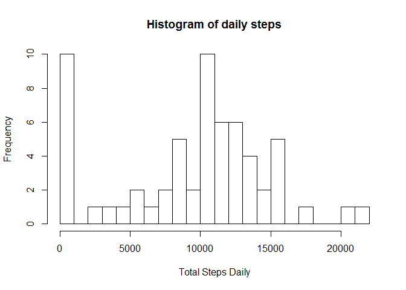
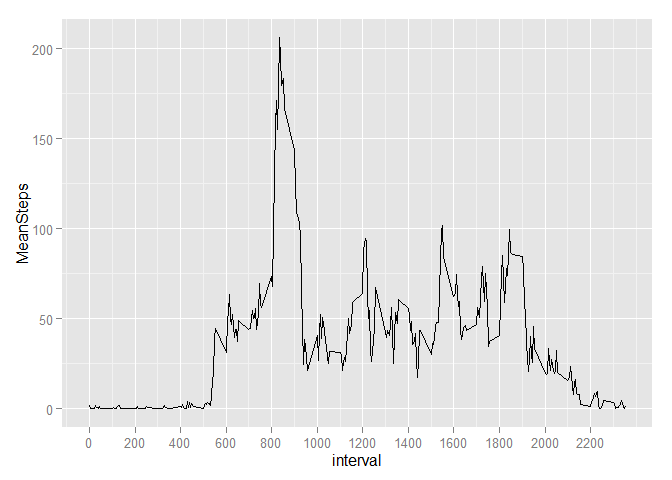
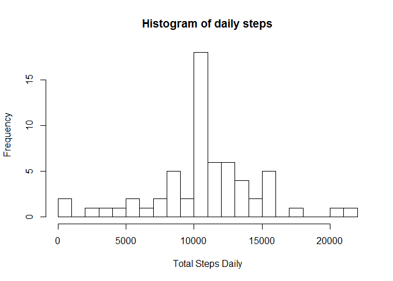
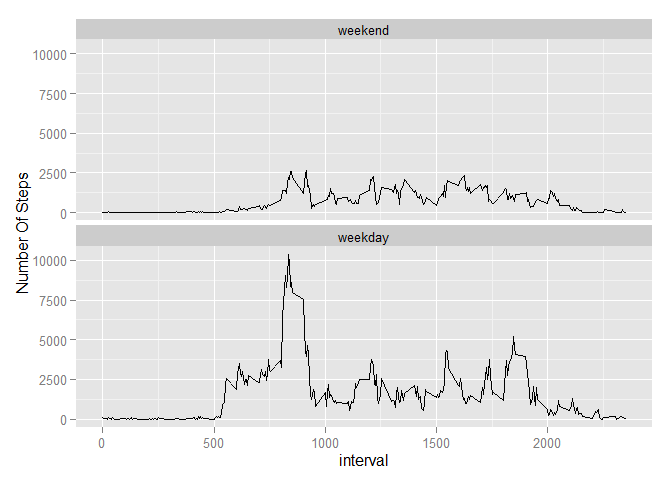

# Reproducible Research: Peer Assessment 1


## Loading and preprocessing the data


```r
unzip(zipfile = "activity.zip")
Activity<-read.csv("activity.csv")
library("lubridate")
Activity$date<-ymd(Activity$date)
```

## What is mean total number of steps taken per day?


```r
options("scipen"=100, "digits"=2)
library(dplyr, quietly = TRUE, warn.conflicts = FALSE)
by_date<-group_by(Activity, date)
SummaryTable<-summarise(by_date, TotalSteps = sum(steps, na.rm = TRUE))
hist(SummaryTable$TotalSteps, breaks=20, xlab = "Total Steps Daily", main = "Histogram of daily steps")
```

 

```r
meansteps<-mean(SummaryTable$TotalSteps)
mediansteps<-median(SummaryTable$TotalSteps)
```
**Mean of total number of steps taken per day 9354.23  
Median of total number of steps taken per day 10395**

## What is the average daily activity pattern?


```r
library(ggplot2)
by_interval<-group_by(Activity, interval)
SummaryTable<-summarise(by_interval, MeanSteps=mean(steps, na.rm = TRUE))
MostPopularInterval<-SummaryTable$interval[which.max(SummaryTable$MeanSteps)]
g<-ggplot(data=SummaryTable, aes(interval, MeanSteps))+geom_line()
g+scale_x_continuous(breaks=seq(min(SummaryTable$interval), max(SummaryTable$interval), 200))
```

 

Interval 835 contains the maximum number of steps on average  

## Imputing missing values


```r
NumOfMissing<-sum(is.na(Activity$steps))
```
  
**Total number of missing values in the dataset is 2304**
  

```r
ImputedActivity<-Activity%>%group_by(interval)%>%mutate(steps = ifelse(is.na(steps), mean(steps, na.rm = TRUE), steps))
by_date<-group_by(ImputedActivity, date)
TotalStepsDaily<-summarise(by_date, TotalSteps = sum(steps, na.rm = TRUE))
hist(TotalStepsDaily$TotalSteps, breaks=20, xlab = "Total Steps Daily", main = "Histogram of daily steps")
```

 

```r
meanTSD<-mean(TotalStepsDaily$TotalSteps)
medianTSD<-(median(TotalStepsDaily$TotalSteps))
```
  
**Mean of total number of steps taken daily is 10766.19**  
**Median of total number of steps taken daily is 10766.19**  
   
We can see that imputing missing values with mean increased total number of steps.  

## Are there differences in activity patterns between weekdays and weekends?


```r
ImputedActivity<-mutate(ImputedActivity, TimeOfWeek=factor(wday(date)<7 & wday(date)>1, labels=c("weekend","weekday")))
by_timeofweek<-group_by(ImputedActivity, TimeOfWeek, interval) 
TotalStepsDailyW<-summarise(by_timeofweek, TotalSteps = sum(steps, na.rm = TRUE))
g<-ggplot(data=TotalStepsDailyW, aes(interval, TotalSteps))
g<-g+geom_line()+facet_wrap(~TimeOfWeek, nrow = 2)+labs(y="Number Of Steps")
g
```

 
